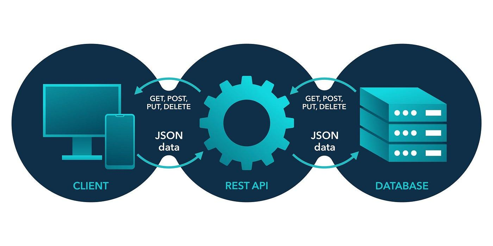
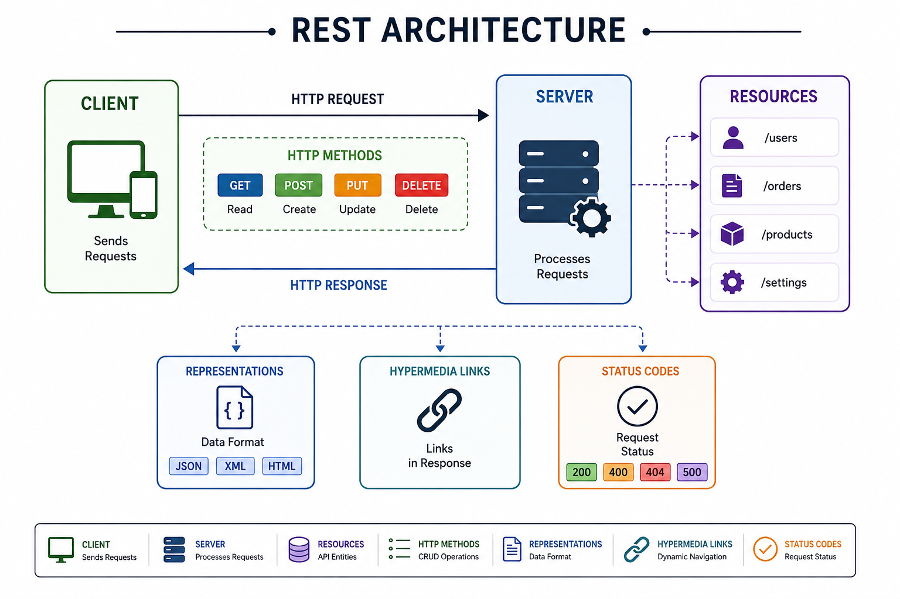

# REST Architecture

Understanding the architecture of how the client and server communicate with each other through Representational State Transfer (REST API).


## 1. Introduction

REST stands for Representational State Transfer and API stands for Application Programme Interface.

An API provides a way for different software applications to communicate with each other, while REST is a software architectural style used to design the web APIs.

REST desfines a set of principles for accessing and manipulating resources over the web using a uniform interface. RESTful web services follow these principals and typically use HTTP for communication between client and servers.

REST API architecture explains how these components interact to provide, access, and manipulating resources. This architectural design describes how the components interact with each other to provide, access, and manipulate resources. The architecture focuses on making APIs easy to develop, maintain and scale.

## 2. REST Architecture

In rest Architecture, the client the client sends an HTTP request to the server to perform an operation on a particular resource. The server, receives a request, process it, may interact with a database, and sends an HTTP response back to the client. Resources such as users, products, or orders are identified using URLs. The data exchanged between the client and server is commonly represented in JSON format. REST uses standard HTTP methods such as GET, POST, PUT, and DELETE to perform operations on resources. This makes REST APIs simple, scalable, and easy to use across different platforms and applications.

### **REST Key Components**

**1. Client** - Sends requests to access or modify resources.
**2. Server** - Processes requests and sends appropriate responses.
**3. Resources** - Key enitities exposed by APIs.
**4. HTTP Methods** - Use to perform CRUD operations on the resources (GET, POST, PUT, DELETE).
**5. Representations** - Data format representing resource state.
**6. Hypermedia Links** - Embedded links in responses to enable dynamic navigation.
**7. Status Codes** - Indicate the status of request (200,400).



## 3. REST Architectural Constraints

There are six architectural constraints in RESTful API.

**1.Uniform Interface** - It is a key constraint that differentiates between a REST API and a Non-REST API. It suggests that there should be a uniform way of interacting with a given server irrespective of device or type of application (website, mobile app).

**2.Stateless** - It means that the necessary state to handle the request is contained within the request itself and server would not store anything related to the session. In REST, the client must include all information for the server to fulfill the request whether as a part of query params, headers or URI. Statelessness enables greater availability since the server does not have to maintain, update or communicate that session state.

**3.Cacheable** - Every response should include whether the response is cacheable or not and for how much duration responses can be cached at the client side. Client will return the data from its cache for any subsequent request and there would be no need to send the request again to the server.

**4.Client Server** - REST application should have a client-server architecture. A Client is someone who is requesting resources and are not concerned with data storage, which remains internal to each server, and server is someone who holds the resources and are not concerned with the user interface or user state. They can evolve independently.

**5.Layered System** - An application architecture needs to be composed of multiple layers. Each layer doesn't know any thing about any layer other than that of immediate layer and there can be lot of intermediate servers between client and the end server.

**6.Code on Demand** - According to this, servers can also provide executable code to the client. The examples of code on demand may include the compiled components such as Java Servlets and Server Side Scripts such as JavaScript.

## 4. HTTP Methods

REST APIs use standard HTTP methods to perform CRUD operations on resources. POST creates a new resource, GET retrieves data, PUT replaces an existing resource, PATCH partially updates it, and DELETE removes it. These methods can target either a resource collection, such as /users, or an individual resource, such as /users/123.
Table below lists the different HTTP methods.

**HTTP Methods and CRUD Operations**

| Method     | CRUD Operation | Collection `/users` | Single Resource `/users/123` |
| ---------- | -------------- | ------------------- | ---------------------------- |
| **POST**   | Create         | Create a new user   | Not used                     |
| **GET**    | Read           | Get all users       | Get user 123                 |
| **PUT**    | Update         | Not usually used    | Replace user 123             |
| **PATCH**  | Modify         | Not usually used    | Partially update user 123    |
| **DELETE** | Delete         | Not usually used    | Delete user 123              |

## 5. Example: User Management REST API

Consider a **User Management API** where a client application needs to create, retrieve, update, and delete user information. Each user is represented as a resource and identified by a unique URL.

### API Endpoints

| Method   | Endpoint     | Purpose           |
| -------- | ------------ | ----------------- |
| `POST`   | `/users`     | Create a new user |
| `GET`    | `/users/123` | Retrieve user 123 |
| `PATCH`  | `/users/123` | Update user 123   |
| `DELETE` | `/users/123` | Delete user 123   |

### Example Request

The client can create a new user by sending a `POST` request:

```http
POST /users
Content-Type: application/json

{
  "name": "Atishay Gangwal",
  "email": "atishaygangwal@example.com"
}
```

The server processes the request and returns:

```http
HTTP/1.1 201 Created
Content-Type: application/json

{
  "id": 123,
  "name": "Atishay Gangwal",
  "email": "atishaygangwal@example.com"
}
```

The newly created user can then be accessed using:

```http
GET /users/123
```

This demonstrates the REST approach where the URL identifies the resource, while the HTTP method defines the operation performed on that resource.

## 6. Conclusion

In this article, we explored RESTful APIs and their architecture, which enable applications to communicate efficiently over the web using HTTP. REST architecture follows principles such as stateless communication, resource-based design, and a uniform interface, providing scalability, flexibility, and maintainability for modern web and mobile applications.

## 7. References

https://medium.com/@shikha.ritu17/rest-api-architecture-6f1c3c99f0d3

https://www.geeksforgeeks.org/javascript/rest-api-architectural-constraints/

https://www.baeldung.com/cs/rest-architecture

https://restfulapi.net/http-methods/

https://www.geeksforgeeks.org/node-js/what-is-restful-api/

https://www.youtube.com/watch?v=-mN3VyJuCjM&t=47s
